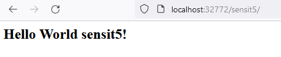

You can't deploy war's to railway.app and usually other cloud providers don't support it either.

They expect you to have self running jar which includes your app + tomcat like in the case of spring boot, or Tomcat Docker image with your app deployed.

To create docker image for your app I recommend:

[bitnami tomcat docker base image](https://hub.docker.com/r/bitnami/tomcat)


1. create docker file *Dockerfile* with content

    ```
    FROM bitnami/tomcat:9.0
    COPY target/sensit5*.war /opt/bitnami/tomcat/webapps/sensit5.war
    ```

2. create docker image

    ``` docker build . -t tomcat_sensit5```


3. run tomcat docker image on random port

    ```docker run --name tomcat_sensit5 -e ALLOW_EMPTY_PASSWORD=yes -P tomcat_sensit5```
    
    ```docker run --name tomcat_sensit5 -p 8080:8080 tomcat_sensit5```

4. find out what port your tomcat app is exposed

    ```docker port tomcat_sensit5```

    *example output where tomcat 8080 is exposed on port 32772*
    ```
    8009/tcp -> 0.0.0.0:32773
    8080/tcp -> 0.0.0.0:32772
    ```

5. access your app locally (replace port from previous step)

    ```http://localhost:32772/sensit5```

    example output:

    


6. you'd need to push docker image to docker hub and deploy that to aws, azuree or some other cloud provider that supports it